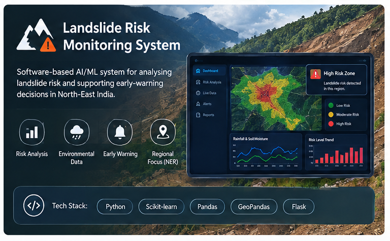
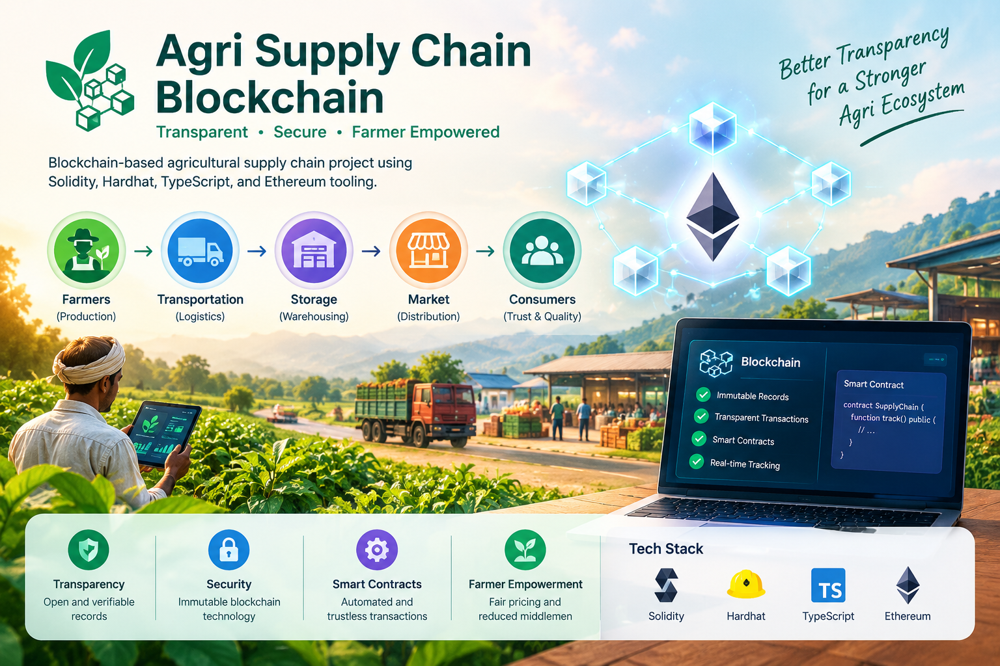
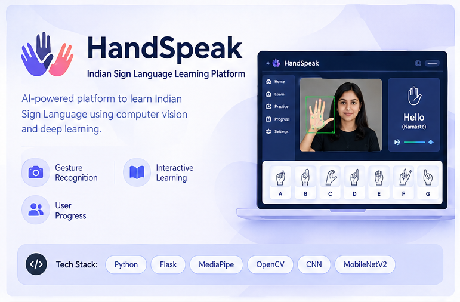
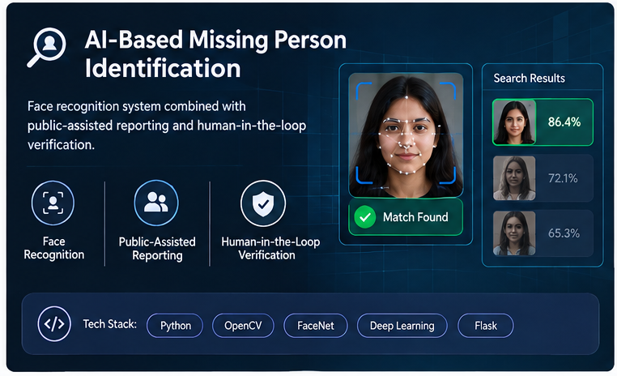

<!--
README inspired by modern GitHub Profile README layouts.

Skill icons:
https://github.com/tandpfun/skill-icons

GitHub Stats:
https://github.com/anuraghazra/github-readme-stats
-->

# 👋 Hi, I'm Sanchita Mote

**`AI & Data Science Student | AI/ML • Computer Vision • Software Development`**

## About Me

- 🎓 B.Tech student in **Artificial Intelligence & Data Science** at Vishwakarma Institute of Technology, Pune.
- 💻 Background in **Computer Engineering** with a Diploma.
- 🤖 Interested in **AI/ML, Deep Learning, Computer Vision, and Applied AI**.
- 🌐 I enjoy building software systems that combine **AI with real-world applications**.
- 🔬 Interested in research-oriented projects involving **intelligent systems and computer vision**.
- 🛡️ Exploring the intersection of **technology, AI, and defence applications**.
- 🚀 Always learning, building, and experimenting with new technologies.

---

## 🧠 Skill Stack

**Also comfortable with:**

Machine Learning • Deep Learning • Computer Vision • Data Science • REST APIs • SQL • Database Systems • Full-Stack Development • Blockchain

---

## 🚀 Projects — Showcase

## 🚀 Projects — Showcase

<table>
  <tr>

    <!-- Landslide -->
    <td align="center" width="50%">
      
       
      <b>🏔️ Landslide Risk Monitoring System</b>
       
      
        Software-based AI/ML system for analysing landslide risk
        and supporting early-warning decisions in North-East India.
      
       
      🔗 <a href="YOUR_LANDSLIDE_REPO_URL">Repo</a>
       
      
        Tags: Machine Learning • Data Science • Risk Monitoring • AI
      
    </td>

    <!-- Agri Supply Chain Blockchain -->
    <td align="center" width="50%">
      
       
      <b>⛓️ Agri Supply Chain Blockchain</b>
       
      
        Blockchain-based agricultural supply chain project using
        Solidity, Hardhat, TypeScript, and Ethereum tooling.
      
       
      🔗
      <a href="https://github.com/motesanchita16/agri-supply-chain-blockchain">
        Repo
      </a>
       
      
        Tags: Blockchain • Solidity • Hardhat • Ethereum • TypeScript
      
    </td>

  </tr>

  <tr>

    <!-- HandSpeak -->
    <td align="center" width="50%">
      
       
      <b>🤟 HandSpeak</b>
       
      
        AI-powered Indian Sign Language learning platform using
        computer vision and deep learning.
      
       
      🔗
      <a href="https://github.com/motesanchita16/Indian-sign-language-learning-platform">
        Repo
      </a>
       
      
        Tags: Computer Vision • Deep Learning • Flask • MediaPipe • CNN
      
    </td>

    <!-- Missing Person -->
    <td align="center" width="50%">
      
       
      <b>🔎 AI-Based Missing Person Identification</b>
       
      
        Face recognition system combined with public-assisted
        reporting and human-in-the-loop verification.
      
       
      🔗
      <a href="YOUR_MISSING_PERSON_REPO_URL">Repo</a>
       
      
        Tags: Face Recognition • Deep Learning • Computer Vision • AI
      
    </td>

  </tr>
</table>

---

## 🔬 Research & Publications

### 🤟 HandSpeak

**HandSpeak: A Computer Vision and Deep Learning-Based Indian Sign Language Learning Platform**

Research work focused on developing an AI-powered platform for Indian Sign Language learning using computer vision and deep learning.

📄 **Scopus-indexed publication**

---

### 🧠 CT to MRI Brain Scan Conversion

**CT to MRI Brain Scan Conversion using Pix2Pix GAN Model**

Research work focused on medical image-to-image translation using a **Pix2Pix Generative Adversarial Network**.

🎤 Presented at **ICETCC 2025**

---

## 🏆 Achievements

- 🥇 **Smart Kopargaon Hackathon — Winner, Transportation Domain**
- 📄 **Scopus-indexed research publication — HandSpeak**
- 🎤 **ICETCC 2025 — Research Paper Presentation**
- 🛡️ **Database Secretary — Vishwa Shauryam, VIT Pune**

---

## 📊 GitHub

  

  

---

## 🔗 Connect With Me

  

  

  

---

  <i>Building with AI. Learning continuously. Creating technology with purpose.</i> 🚀

